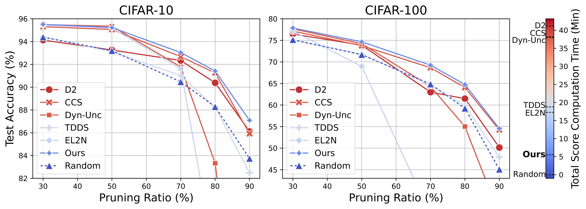

# ✂️ Lightweight Dataset Pruning without Full Training via Example Difficulty and Prediction Uncertainty

This repository provides an implementation of **Difficulty and Uncertainty-Aware Lightweight (DUAL)** data pruning, along with other data pruning algorithms.
For more details, check out our paper on [arXiv](https://arxiv.org/abs/2502.06905)

---
## 🚀 Usage  

Please refer to each folder for dataset-specific experiments:  
- **`exp_cifar`** for CIFAR (10, 100) experiments  
- **`exp_imagenet`** for ImageNet experiments  

---
## 📊 Results
**DUAL** pruning enables efficient dataset pruning without requiring full training on the original dataset while achieving SOTA performance.



- **Left**: Test accuracy comparison on CIFAR-10 dataset under different pruning ratios.
- **Right**: Test accuracy comparison on CIFAR-100 dataset under different pruning ratios.
- The color represents the total computation time, including the time spent training the original
dataset for score calculation for each pruning method. Blue indicates lower computation time, while red
indicates higher computation time. *Our method demonstrates its ability to minimize computation time while
maintaining SOTA performance*.
---

## 📌 Available Data Pruning Algorithms  
- **Forgetting**  [https://arxiv.org/abs/1812.05159](https://arxiv.org/abs/1812.05159)
- **EL2N**  [https://arxiv.org/abs/2107.07075](https://arxiv.org/abs/2107.07075)
- **AUM**  [https://arxiv.org/abs/2001.10528](https://arxiv.org/abs/2001.10528)
- **CCS**  [https://arxiv.org/abs/2210.15809](https://arxiv.org/abs/2210.15809)
- **Entropy**  [https://arxiv.org/abs/1906.11829](https://arxiv.org/abs/1906.11829)
- **Dyn-Unc**  [https://arxiv.org/abs/2306.05175](https://arxiv.org/abs/2306.05175)
- **TDDS**  [https://arxiv.org/abs/2311.13613](https://arxiv.org/abs/2311.13613)
- **DUAL** (**ours**)  [https://arxiv.org/abs/2502.06905](https://arxiv.org/abs/2502.06905)

---
## 📚 Citation
```bibtex
@article{cho2025lightweight,
  title={Lightweight Dataset Pruning without Full Training via Example Difficulty and Prediction Uncertainty},
  author={Cho, Yeseul and Shin, Baekrok and Kang, Changmin and Yun, Chulhee},
  journal={arXiv preprint arXiv:2502.06905},
  year={2025}
}
```
